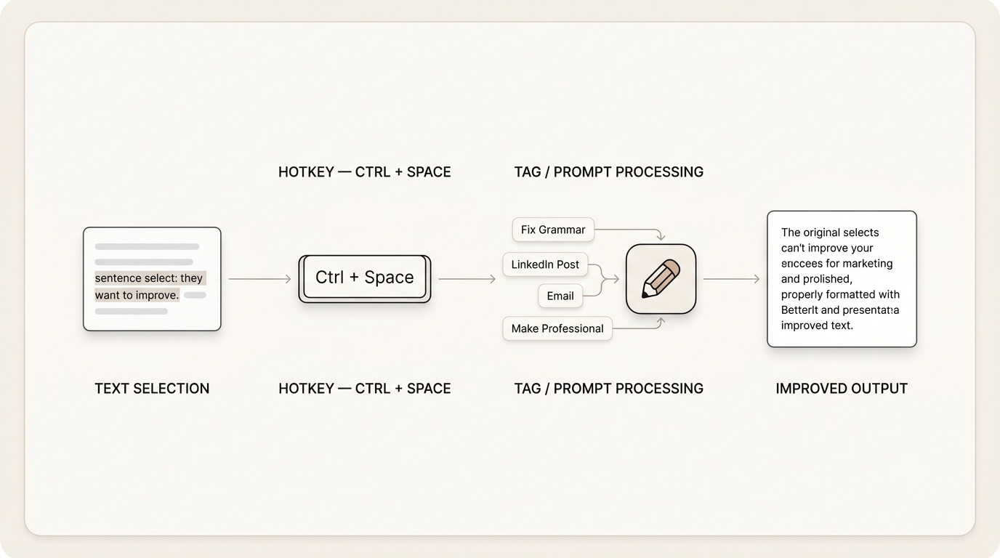

# Better It

A system-wide writing assistant for Windows. Select text in any application, press **Ctrl+Space**, and a floating window opens with a grammar-corrected version. Click **Replace** to paste it back.

## Demo

<video src="public/demo.mp4" controls width="600"></video>

## Installation

### Windows

Better It can be installed directly from the latest GitHub release using PowerShell.

Open **PowerShell as Administrator** and run:

```powershell
irm "https://raw.githubusercontent.com/KavimugilRajasekar/BetterIt/main/installer/Install-BetterIt.ps1" | iex
```

The installer will automatically:

* Fetch the latest Better It release from GitHub.
* Download the latest `BetterIt.exe`.
* Create `C:\Program Files\BetterIt`.
* Remove the previous Better It installation if it already exists.
* Install the latest `BetterIt.exe`.
* Create a Windows startup shortcut.
* Add Better It to `shell:startup`.
* Start Better It automatically.
* Display the installed version after installation.

Once installation is complete, Better It will run in the background.

Press **Ctrl+Space** at any time to open the Better It configuration window.

> **Note:** The PowerShell terminal must be opened as **Administrator** because Better It is installed under `C:\Program Files`.

## Configuration

Better It provides configuration through its application window.

Press:

```text
Ctrl + Space
```

to open the Better It configuration.

You can configure options such as the API settings, model, and hotkey from the application.

## Usage

1. Select text in any application.
2. Press **Ctrl+Space**.
3. Click **Correct Grammar**.
4. Review the corrected text.
5. Click **Replace** to paste the improved text back into the original application.
6. Press **Esc** to dismiss the window.

## Application Pipeline



The application operates in a linear pipeline:

1. **Trigger:** The system monitors for the `Ctrl+Space` hotkey.

2. **Extraction:** Upon trigger, Better It simulates a `Ctrl+C` command to capture the currently selected text from the active window.

3. **Processing:** The captured text is transmitted to the configured LLM API with a grammar-correction prompt.

4. **Presentation:** The resulting text is rendered in an always-on-top floating window for user review.

5. **Integration:** Upon clicking **Replace**, Better It sets the system clipboard to the corrected text and simulates `Ctrl+V` to insert it into the original application.

## Known Limitations

* Certain applications that block programmatic clipboard access may not work.
* Switching active windows between triggering Better It and replacing the text can cause the paste to land in the wrong application.
* Centering is optimized for single-monitor setups.
* Responses are not streamed; the UI waits for the full API response.
* Windows only.

## Future Roadmap

* Live text synchronization.
* Additional actions such as **Formal**, **Casual**, **Shorten**, and **Expand**.
* Local LLM integration via Ollama.
* OS accessibility and UI Automation for direct replacement.
* Theme toggles.
* Cross-platform support for macOS and Linux.

## Troubleshooting

### Hotkey not working

Make sure Better It is running and check whether another application is already using `Ctrl+Space`.

If necessary, run Better It with appropriate Windows permissions.

### API Errors

Verify your API configuration and make sure your computer has an active internet connection.

### Paste failure

Some applications, particularly certain Electron-based applications, may ignore simulated `Ctrl+V` operations.

### Installation problems

Make sure PowerShell is running as **Administrator** and run the installation command again:

```powershell
irm "https://raw.githubusercontent.com/KavimugilRajasekar/BetterIt/main/installer/Install-BetterIt.ps1" | iex
```

## Development

If you want to develop or modify Better It from source, clone the repository and create a Python virtual environment:

```powershell
git clone https://github.com/KavimugilRajasekar/BetterIt.git
cd BetterIt

python -m venv .venv
.venv\Scripts\activate

pip install -e .
```

If `pip install -e .` fails because of the `keyboard` library on Windows, run the terminal as Administrator.

### Environment Configuration

For development, copy the example environment file:

```powershell
copy .env.example .env
```

Edit `.env` and configure the required API settings.

You may also modify options such as the model or hotkey depending on the current application configuration.

### Running from Source

```powershell
python run.py
```

The application runs in the background with a tray icon. To exit, right-click the tray icon and select **Quit**.

## Collaboration

We welcome contributions. Please refer to the following files for more information:

* [Contributing Guidelines](CONTRIBUTING.md)
* [Code of Conduct](CODE_OF_CONDUCT.md)
